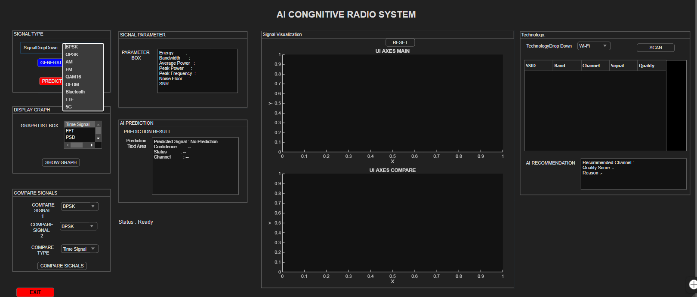
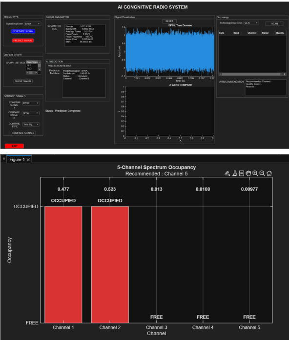
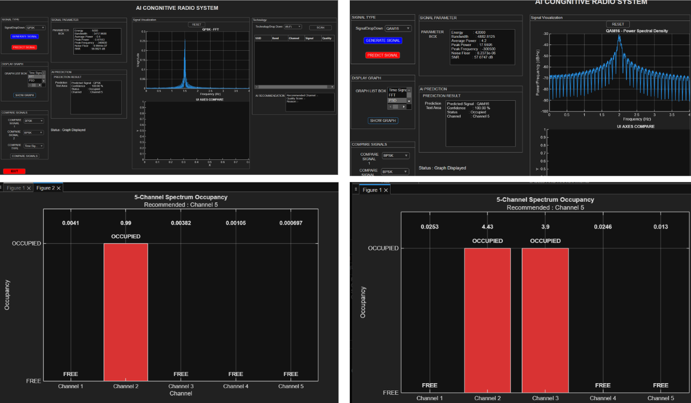
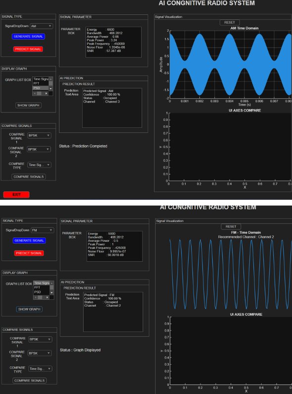
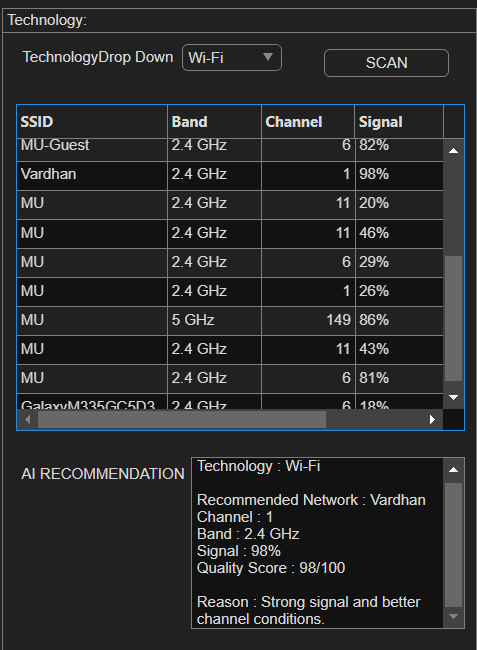
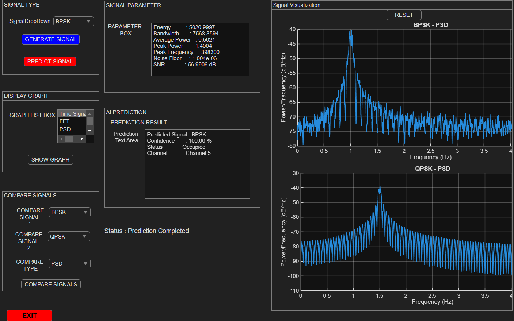

# AI-Cognitive-Radio

An interactive MATLAB-based cognitive radio platform for communication signal generation, channel simulation, spectrum analysis, signal comparison, and intelligent channel detection.
---

## Overview

This project presents an interactive AI-based Cognitive Radio platform developed in MATLAB for exploring communication signals, channel behavior, spectrum characteristics, and channel occupancy. The system brings multiple communication-signal generation and analysis functions into a single interactive environment.
The platform supports the generation of analog, digital, multicarrier, and wireless communication signals. It also provides a multi-channel simulation workflow that creates channels, scans the spectrum, processes channel information, and detects channels.
The MATLAB interface combines signal generation, signal visualization, signal comparison, signal-parameter display, spectrum analysis, AI prediction, and wireless-network analysis in one application. The project is intended as an experimental platform for studying the main stages involved in a cognitive-radio workflow.
---

## Problem Statement

Wireless environments contain multiple signals occupying different frequency bands, and the availability of a channel can change with time and location. A cognitive radio system needs to observe its surrounding spectrum, analyze the detected signals or channels, identify channel occupancy, and support decisions based on the available information.
This project addresses this problem by developing an interactive simulation environment in MATLAB where different communication signals can be generated, passed through simulated channel conditions, analyzed in the frequency domain, compared, and evaluated through a multi-channel spectrum workflow.
---

## System Architecture

The system follows a processing pipeline consisting of signal generation,
channel simulation, spectrum analysis, signal processing, channel
detection, and intelligent decision-making.
**Signal Generation**  
↓  
**Channel Simulation**  
↓  
**Spectrum Scanning**  
↓  
**Signal / Channel Processing**  
↓  
**Channel Detection**  
↓  
**AI Prediction / Recommendation**  
↓  
**Cognitive Radio Analysis**
---

## Main Features

- Interactive MATLAB App Designer interface
- Communication signal generation
- Analog and digital modulation analysis
- Channel simulation
- Spectrum scanning
- Frequency-domain signal visualization
- Signal comparison
- Multi-channel spectrum simulation
- Channel occupancy analysis
- Channel detection
- AI-based signal classification
- Wi-Fi and wireless-network analysis
---

## Supported Communication Signals
The signal-generation menu in the MATLAB implementation provides the following signal options:

| Category | Signal | Purpose |
|---|---|---|
| Digital Modulation | BPSK | Digital communication signal analysis |
| Digital Modulation | QPSK | Digital communication signal analysis |
| Digital Modulation | 16-QAM | Higher-order digital modulation |
| Analog Modulation | AM | Analog modulation analysis |
| Analog Modulation | FM | Analog modulation analysis |
| Multicarrier | OFDM | Multicarrier signal analysis |
| Wireless | Bluetooth | Wireless signal analysis |
| Cellular | LTE | Cellular signal analysis |
| Cellular | 5G | Cellular signal analysis |
---

## Interactive MATLAB Dashboard

The application provides a graphical interface for selecting signal types, displaying signal parameters, generating signals, simulating channels, scanning the spectrum, comparing signals, viewing prediction information, and examining wireless-network information.

---

## BPSK Signal and Channel Analysis

The BPSK workflow demonstrates digital signal generation together with channel simulation and visualization. The interface displays the generated signal and associated analysis information, allowing the behavior of the signal under the selected channel condition to be examined.

---

## QPSK and 16-QAM Analysis

The platform supports QPSK and 16-QAM as digital modulation options. The corresponding visualization can be used to examine time-domain behavior, frequency-domain characteristics, and modulation-specific representations shown by the application.

---

## AM and FM Analysis

The platform also includes analog modulation analysis using AM and FM. The generated waveforms and their frequency-domain characteristics can be visualized through the application.

---

## Spectrum and Wireless Network Analysis

The application includes spectrum-oriented visualization for examining signal characteristics in the frequency domain. The dashboard also provides a wireless-network analysis section where information such as SSID, band, channel, signal level, and quality can be displayed.
The same interface is designed to support analysis of wireless technologies and environments including Wi-Fi, Bluetooth, hotspot connectivity, and cellular technologies such as LTE.

---

## Multi-Channel Simulation and Channel Detection

The multi-channel workflow is a central part of the cognitive-radio simulation. The implementation creates multiple channels and then passes the channel set through spectrum scanning, channel processing, and channel detection stages. The resulting visualization can be used to distinguish occupied and free channels.

---

## Signal Comparison

The platform includes a signal-comparison function that allows two generated signals to be selected and compared using the available visualization interface. This provides a direct way to examine differences between communication signals.

---

## AI Prediction and Recommendation

The cognitive-radio platform incorporates a MATLAB Classification Tree for automatic signal identification. The classifier uses extracted signal characteristics to determine the most likely communication signal type from the available signal classes.
The model uses the following eight signal features as inputs:
- Energy
- Average Power
- Peak Power
- Peak-to-Peak Value
- Peak Frequency
- Bandwidth
- Noise Floor
- Signal-to-Noise Ratio (SNR)
Before classification, the extracted features are normalized using the saved training-data feature ranges. The normalized feature vector is then provided to the Classification Tree, which predicts the corresponding signal class.
The prediction output is integrated into the cognitive-radio dashboard, where the predicted signal, associated channel information, prediction status, and classification results are displayed. The classification result can then contribute to the channel-analysis and recommendation workflow.
---

## Technologies and Concepts

- Digital Signal Processing
- Communication Systems
- Analog and Digital Modulation
- Spectrum Analysis
- Channel Simulation
- Cognitive Radio Concepts
- Wireless Communication
---

## Software Tools

Primary development environment: MATLAB with a MATLAB App Designer graphical interface.
The project is organized around MATLAB scripts/functions for signal generation and multi-channel processing together with the graphical application interface.
---

## Results and Demonstration

The project demonstrates an integrated MATLAB environment for communication-signal generation and cognitive-radio-oriented spectrum analysis. The screenshots provide visual evidence of signal generation, modulation analysis, spectrum visualization, wireless-network information, and multi-channel channel-occupancy detection.
- Multiple communication signal types can be selected and generated.
- Signals can be visualized in the application interface.
- Channel simulation and spectrum analysis are available.
- Multiple channels can be simulated and processed.
- Occupied/free channel information can be displayed.
- Wireless-network parameters can be displayed in the interface.
---

## Limitations

- The current project is primarily a MATLAB-based simulation and analysis platform.
- The screenshots represent the implemented application interface and simulation results rather than measurements from a deployed RF hardware platform.
- Real-time SDR-based RF acquisition is not claimed unless it is actually implemented and demonstrated.
---

 ## Project Information
 
**Developed by:** D.V. Sai Vijay Vardhan  
**Program:** B.Tech in Electronics and Communication Engineering  
**Institution:** Mahindra University, Hyderabad  
**Project Domain:**  
Cognitive Radio • Signal Processing • Wireless Communication • Spectrum Analysis
---

